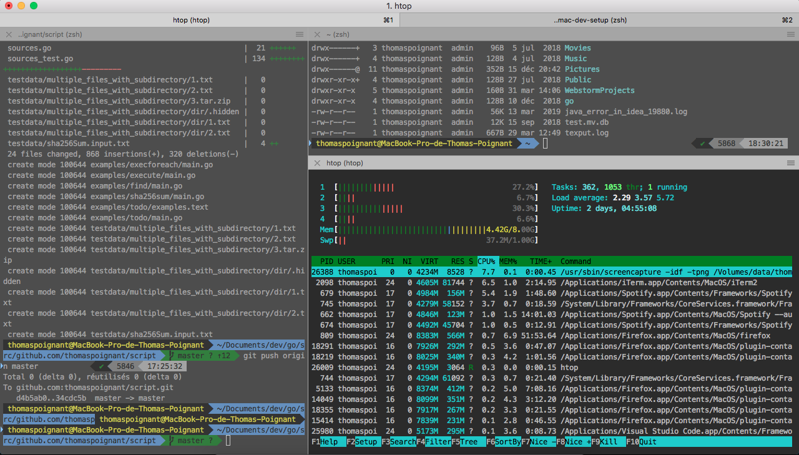
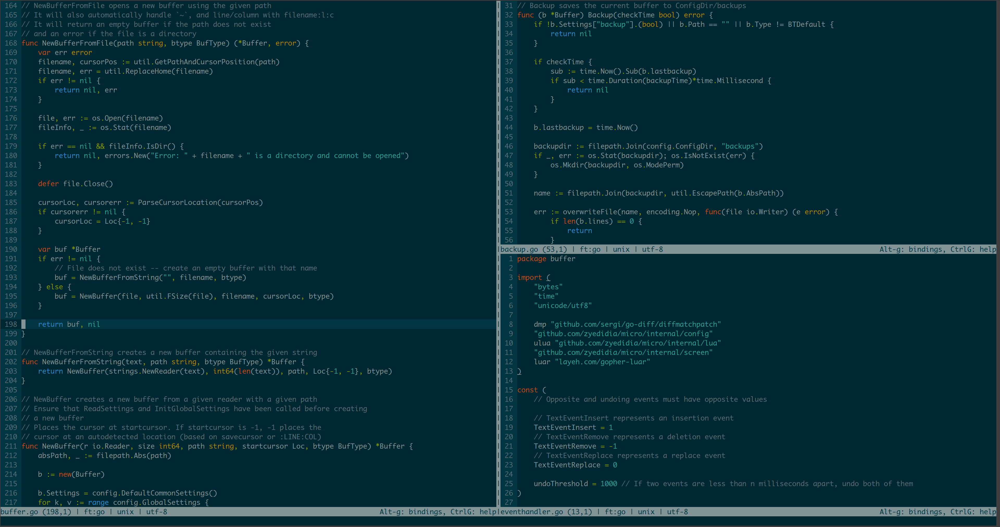
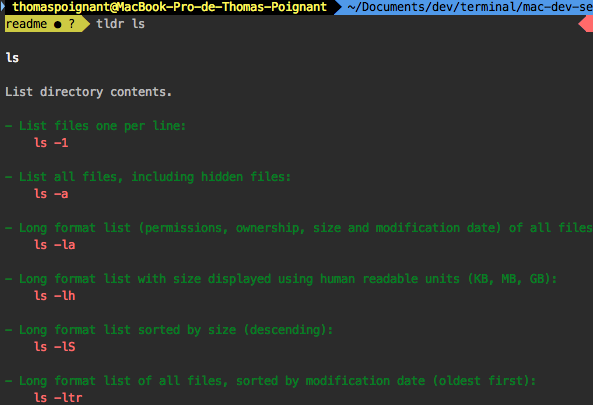
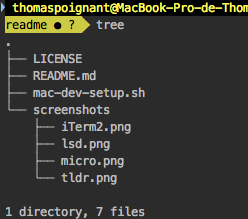

# mac-dev-setup
![made-with-bash](https://img.shields.io/badge/-Made%20with%20Bash-1f425f.svg?logo=image%2Fpng%3Bbase64%2CiVBORw0KGgoAAAANSUhEUgAAABgAAAAYCAYAAADgdz34AAAAGXRFWHRTb2Z0d2FyZQBBZG9iZSBJbWFnZVJlYWR5ccllPAAAAyZpVFh0WE1MOmNvbS5hZG9iZS54bXAAAAAAADw%2FeHBhY2tldCBiZWdpbj0i77u%2FIiBpZD0iVzVNME1wQ2VoaUh6cmVTek5UY3prYzlkIj8%2BIDx4OnhtcG1ldGEgeG1sbnM6eD0iYWRvYmU6bnM6bWV0YS8iIHg6eG1wdGs9IkFkb2JlIFhNUCBDb3JlIDUuNi1jMTExIDc5LjE1ODMyNSwgMjAxNS8wOS8xMC0wMToxMDoyMCAgICAgICAgIj4gPHJkZjpSREYgeG1sbnM6cmRmPSJodHRwOi8vd3d3LnczLm9yZy8xOTk5LzAyLzIyLXJkZi1zeW50YXgtbnMjIj4gPHJkZjpEZXNjcmlwdGlvbiByZGY6YWJvdXQ9IiIgeG1sbnM6eG1wPSJodHRwOi8vbnMuYWRvYmUuY29tL3hhcC8xLjAvIiB4bWxuczp4bXBNTT0iaHR0cDovL25zLmFkb2JlLmNvbS94YXAvMS4wL21tLyIgeG1sbnM6c3RSZWY9Imh0dHA6Ly9ucy5hZG9iZS5jb20veGFwLzEuMC9zVHlwZS9SZXNvdXJjZVJlZiMiIHhtcDpDcmVhdG9yVG9vbD0iQWRvYmUgUGhvdG9zaG9wIENDIDIwMTUgKFdpbmRvd3MpIiB4bXBNTTpJbnN0YW5jZUlEPSJ4bXAuaWlkOkE3MDg2QTAyQUZCMzExRTVBMkQxRDMzMkJDMUQ4RDk3IiB4bXBNTTpEb2N1bWVudElEPSJ4bXAuZGlkOkE3MDg2QTAzQUZCMzExRTVBMkQxRDMzMkJDMUQ4RDk3Ij4gPHhtcE1NOkRlcml2ZWRGcm9tIHN0UmVmOmluc3RhbmNlSUQ9InhtcC5paWQ6QTcwODZBMDBBRkIzMTFFNUEyRDFEMzMyQkMxRDhEOTciIHN0UmVmOmRvY3VtZW50SUQ9InhtcC5kaWQ6QTcwODZBMDFBRkIzMTFFNUEyRDFEMzMyQkMxRDhEOTciLz4gPC9yZGY6RGVzY3JpcHRpb24%2BIDwvcmRmOlJERj4gPC94OnhtcG1ldGE%2BIDw%2FeHBhY2tldCBlbmQ9InIiPz6lm45hAAADkklEQVR42qyVa0yTVxzGn7d9Wy03MS2ii8s%2BeokYNQSVhCzOjXZOFNF4jx%2BMRmPUMEUEqVG36jo2thizLSQSMd4N8ZoQ8RKjJtooaCpK6ZoCtRXKpRempbTv5ey83bhkAUphz8fznvP8znn%2B%2F3NeEEJgNBoRRSmz0ub%2FfuxEacBg%2FDmYtiCjgo5NG2mBXq%2BH5I1ogMRk9Zbd%2BQU2e1ML6VPLOyf5tvBQ8yT1lG10imxsABm7SLs898GTpyYynEzP60hO3trHDKvMigUwdeaceacqzp7nOI4n0SSIIjl36ao4Z356OV07fSQAk6xJ3XGg%2BLCr1d1OYlVHp4eUHPnerU79ZA%2F1kuv1JQMAg%2BE4O2P23EumF3VkvHprsZKMzKwbRUXFEyTvSIEmTVbrysp%2BWr8wfQHGK6WChVa3bKUmdWou%2BjpArdGkzZ41c1zG%2Fu5uGH4swzd561F%2BuhIT4%2BLnSuPsv9%2BJKIpjNr9dXYOyk7%2FBZrcjIT4eCnoKgedJP4BEqhG77E3NKP31FO7cfQA5K0dSYuLgz2TwCWJSOBzG6crzKK%2BohNfni%2Bx6OMUMMNe%2Fgf7ocbw0v0acKg6J8Ql0q%2BT%2FAXR5PNi5dz9c71upuQqCKFAD%2BYhrZLEAmpodaHO3Qy6TI3NhBpbrshGtOWKOSMYwYGQM8nJzoFJNxP2HjyIQho4PewK6hBktoDcUwtIln4PjOWzflQ%2Be5yl0yCCYgYikTclGlxadio%2BBQCSiW1UXoVGrKYwH4RgMrjU1HAB4vR6LzWYfFUCKxfS8Ftk5qxHoCUQAUkRJaSEokkV6Y%2F%2BJUOC4hn6A39NVXVBYeNP8piH6HeA4fPbpdBQV5KOx0QaL1YppX3Jgk0TwH2Vg6S3u%2BdB91%2B%2FpuNYPYFl5uP5V7ZqvsrX7jxqMXR6ff3gCQSTzFI0a1TX3wIs8ul%2Bq4HuWAAiM39vhOuR1O1fQ2gT%2F26Z8Z5vrl2OHi9OXZn995nLV9aFfS6UC9JeJPfuK0NBohWpCHMSAAsFe74WWP%2BvT25wtP9Bpob6uGqqyDnOtaeumjRu%2ByFu36VntK%2FPA5umTJeUtPWZSU9BCgud661odVp3DZtkc7AnYR33RRC708PrVi1larW7XwZIjLnd7R6SgSqWSNjU1B3F72pz5TZbXmX5vV81Yb7Lg7XT%2FUXriu8XLVqw6c6XqWnBKiiYU%2BMt3wWF7u7i91XlSEITwSAZ%2FCzAAHsJVbwXYFFEAAAAASUVORK5CYII%3D) [](http://unlicense.org/)
[](https://travis-ci.com/thomaspoignant/mac-dev-setup)


This script allow you to install all the tools you need for setting up your dev environnement on your brand new mac.

# Launch installation
```shell
curl https://raw.githubusercontent.com/thomaspoignant/mac-dev-setup/master/mac-dev-setup.sh | bash
```

# What does it install?

It will install all this tools:
- ## Homebrew
  The Missing Package Manager for macOS, Homebrew installs the stuff you need that Apple (or your Linux system) didn’t.

  After the installation you will be available to install almost everything you need for your mac. You can list installed packages with `brew list` and `brew cask list`.

  I recommend running brew doctor every now and then to make sure things are good and `brew cleanup` to remove unused files.
- ## iTerm2
  iTerm2 is a replacement for Terminal (https://www.iterm2.com/).

  My favorites is that you can split your terminal in multiple views.

  

- ## zsh / oh-my-zsh
  A delightful community-driven (with 1500+ contributors) framework for managing your zsh configuration. Includes 200+ optional plugins (rails, git, OSX, hub, capistrano, brew, ant, php, python, etc), over 140 themes to spice up your morning, and an auto-update tool so that makes it easy to keep up with the latest updates from the community. https://ohmyz.sh/

  There is a ton of great things to do with oh-my-zsh. [Powerlevel10k](https://github.com/romkatv/powerlevel10k) is my theme of choice.
  
  There are also a lot of [plugins](https://github.com/ohmyzsh/ohmyzsh/wiki/Plugins) availablem go check it you will certainly find some things great for your usage.

- ## Most used command line tools.
  - ### [ack](https://github.com/beyondgrep/ack3/)
    `ack` is designed as a replacement for 99% of the uses of grep.

  - ### [bash-completion](https://github.com/scop/bash-completion)
    Programmable completion functions for bash.

  - ### [curl](https://linux.die.net/man/1/curl)
    Command line tool and library for transferring data with URLs.

  - ### [htop](https://github.com/hishamhm/htop)
    Similar to top but allows you to scroll vertically and horizontally.

  - ### [jq](https://stedolan.github.io/jq/)
    `jq` is a lightweight and flexible command-line JSON processor.

  - ### [libpq](https://www.postgresql.org/docs/current/libpq.html)
     `libpq` is the postgres client command line.

  - ### [lsd](https://github.com/Peltoche/lsd)
    The next gen ls command.

    Pimp your `ls` command to display icons and color to have a better experience.

    
  - ### [micro](https://micro-editor.github.io/)
    A modern and intuitive terminal-based text editor.

    
  - ### [tldr](https://github.com/tldr-pages/tldr)
    A collection of simplified and community-driven man pages.

    

  - ### [tree](https://linux.die.net/man/1/tree)
    `tree` is a recursive directory-listing program that produces a depth indented listing of files.

    

  - ### [wget](https://www.gnu.org/software/wget/)
    Software package for retrieving files using HTTP, HTTPS, FTP and FTPS.

- ## GIT
  Git is a free and open source distributed version control system designed to handle everything from small to very large projects with speed and efficiency.
  - ### [git-alias](https://github.com/thomaspoignant/gitalias)
    Some great aliases to make your life easier when using GIT command line.

    There are a lot of useful aliases, like `git ls` or `git ll` who allow to see your git history.
    There is a lot more you should check [https://github.com/thomaspoignant/gitalias](https://github.com/thomaspoignant/gitalias) to see the list of available aliases.
  - ### [git-secrets](https://github.com/awslabs/git-secrets)
    Prevents you from committing passwords and other sensitive information to a git repository.

    You're not done yet! You MUST install the git hooks for every repo that you wish to use with `git secrets --install`.

- ## IDE
  ### [Jetbrains toolbox](https://www.jetbrains.com/toolbox-app/)
    Jetbrains make the best IDEs in the market, `Intellij`, `Webstorm` or `Goland` are awesome.

    We don't want to install all of them because you propably don't need all of them, but the jetbrains toolbox allow you to manage all your installation and update of your jetbrains products.

  ### [Visual Studio Code](https://code.visualstudio.com/)
    A great text editor who can be an IDE sometimes.

- ## Development
  ### API
  - [**ngrok**](https://ngrok.com/)  
    `ngrok` is a great tool who allow to create a port tunnel from your local development environement to internet. So you can expose your local APIs online for testing purpose.
  
  - [**postman**](https://www.postman.com)  
    `postman` allow to quickly and easily send REST, SOAP, and GraphQL requests directly within Postman.
  
  ### AWS
  - [**awscli**](https://aws.amazon.com/fr/cli/)  
    Official AWS command line

  - [**saws**](https://github.com/donnemartin/saws)  
    A supercharged AWS command line interface.
  
  ### Database tools
  - [**DBeaver**](https://dbeaver.io/)  
    `DBeaver` is a nice database viewer who works with most of the recent DB engine.

  ### FTP/SFTP
  - [**Cyberduck**](https://cyberduck.io)  
    `cyberduck` is a libre server and cloud storage browser for Mac.

  ### Docker
    Should I present what `docker` is?

    To work with docker we will install the docker runtime and also the docker command line completion who help you to write docker command like a boss.
    - docker
    - docker command line completion

  ### Languages
  The main languages I am working with are Java and Go, but here are some of the main languages you always need, on projects.

  - **Java**  
    Install the last version of the `openJDK` JVM.
  - **Go / Golang**  
    Install the last `go` version and set `GOPATH` into your shell profile file.
  - **NodeJS**  
    Install `nvm` and the last version of `nodejs`.
  - **Python**  
    Install `python` and `pip` so you are ready to go.
  - **Terraform**  
    Install the last version of `terraform` and you are ready to code your infrastructure.


- ## Productivity tools
  Development is not coding all day, you also have to collaborate with people and to use you mac for different kind of things.

  Here are the most common tools I use every day to work.
  - ### [Evernote](https://evernote.com/)
    Note taking app.

  - ### [KAP](https://getkap.co/)
    This is the best screen capture app right now.

    Export your video capture as a `GIF` and sharing them is super easy.

  - ### [Rectangle](https://rectangleapp.com/)
    Move and resize windows in macOS using   keyboard shortcuts or snap areas.

    I use Rectangle a lot — you should master its shortcuts. The main ones I use are:
    ```  - ###  shell
      Left half: ⌥⌘ Arrow-Left
      Right half: ⌥⌘ Arrow-Right
      Top half: ⌥⌘ Arrow-Up
      Bottom half: ⌥⌘ Arrow-Down
      Center window: ⌥⌘ C
      Maximize window: ⌥⌘ F
    ```

  - ### [Slack](https://slack.com/)
    The Collaboration Hub.
    I am not sure I need to present what is slack.

  - ### [Spotify](http://spotify.com/)
    Music streaming.

  - ### [Whatsapp](https://www.whatsapp.com/)
    Messaging system.
    I am not sure I need to present what is whatsapp.

  - ### [VLC](https://www.videolan.org)
    Free and open source cross-platform multimedia player that plays most multimedia files, and various streaming protocols.

- ## Web browsers
  Because most of the development projects need some web related tools, you need to have most importants web browser of the market.

  Here we install, the 3 main one:
  - Google Chrome
  - Mozilla Firefox
  - Microsoft Edge
